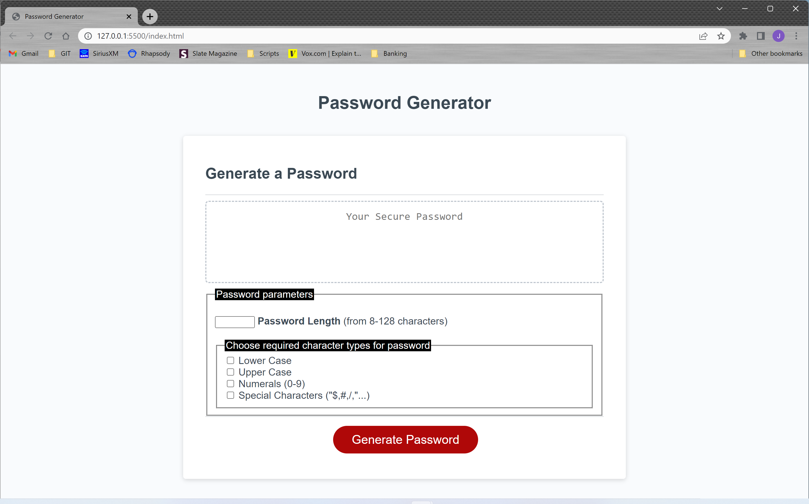

# Joseph Lamb

## Project
Challenge 3 - Javascript:
Random password generator that makes passwords based on length and character parameters.

## User Story
As an employee with access to sensitive data 
we to randomly generate a password that meets certain criteria 
So that can create a strong password that provides greater security 

## Acceptance Criteria
GIVEN employees need a new, secure password 
WHEN they click the button to generate a password 
THEN they are presented with a series of prompts for password criteria 
THEN they select which criteria to include in the password and are prompted for the length of the password 
THEN they choose a length of at least 8 characters and no more than 128 characters 
WHEN asked for character types to include in the password 
THEN they confirm whether or not to include lowercase, uppercase, numeric, and/or special characters 
THEN their input should be validated and at least one character type should be selected 
WHEN all prompts are answered a password is generated that matches the selected criteria 
THEN the password is either displayed in an alert or written to the page 

## Installation
Github: git@github.com:jlamb88/3-Random-Password-Generator.git

URL: https://github.com/jlamb88/3-Random-Password-Generator.git

## Usage

